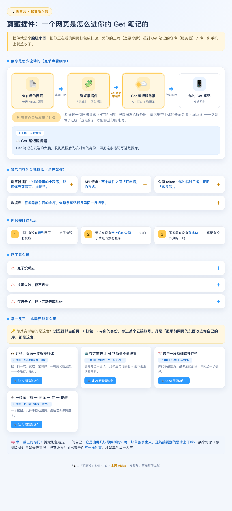

# 拆盲盒 · Learn After Doing

> 反向科普 —— 先用 AI 做出来，再回头把它搞懂。
> A Claude skill that reverse-explains whatever AI just built for you, as an interactive page a non-technical person can actually understand.

AI 让小白做出了超出自己能力的东西——一个浏览器插件、一个网页、一个小程序、一个自动化、甚至另一个 Skill。**但"做出来"和"搞懂了"是两回事。** 如果你没有技术背景，AI 帮你做好了，你也不知道它背后到底怎么跑的，下次坏了还是不会。

**拆盲盒** 就补这一层：它读你（或 AI）刚做出来那东西的**工程文件**，生成一个**浅色、可交互的网页**，把黑箱拆开给你看——数据从哪流到哪、用了什么技术、你只需盯哪几点、坏了怎么一键交给 AI 修。

**知其然，更知其所以然。** 你不用成为开发者，但得知道原理、知道坏了怎么办。



## 它产出什么

一个自包含的 HTML 页面（能在浏览器打开、能发小红书/公众号），包含：

- **一句话本质** —— 用生活类比说清"它其实就是个啥"
- **动态信息流图** —— 点一下，看数据一步步流过去；每个节点可点、看细节；每一跳标清「本机内 🔒 / 联网 🌐」
- **关键概念** —— 点开就展开的人话解释（令牌=工牌、API=打电话、服务器=仓库…）
- **你只需盯这几点** —— 链路上最容易断的 3 个环
- **坏了怎么修** —— 大白话原因 + 一句能**一键复制、直接甩给 AI** 的话
- **举一反三** —— 点破可迁移的「本质模式」，把它拆成几块可复用的零件，每块都能一键让 AI 拿去做**不一样**的新东西；再附上从社区搜到的真实相似案例

## 设计哲学

> **理解，留在页面上；动手，交给 AI。**

页面负责让小白"知其所以然"；一切要动手修的，都做成一句能复制给 AI 的话。小白的路径是：**看懂 → 复制 → 粘给 AI → 修好**，全程不碰代码。

## 安装

克隆到你的 Claude Code 技能目录：

```bash
git clone https://github.com/vickysy/learn-after-doing.git ~/.claude/skills/拆盲盒
```

## 用法

任何时候 AI 帮你做了个你想搞懂的东西，跟它说一句 **「拆盲盒」**（或"这是怎么做出来的""帮我拆一下背后原理"），再告诉它代码在哪：

```
拆盲盒：帮我拆解 ~/projects/my-clipper 这个插件的原理
```

它会去读工程文件、抽出拆解规格、生成网页并打开。刚做完某件事时也可以直接调用——它知道刚改过哪些文件。

## 工作原理（三层架构）

1. **读物证** —— 读完成该任务的工程文件（清单/入口/发请求/鉴权处）+ 对话上下文
2. **抽规格** —— 从代码里提炼一份结构化「拆解规格 SPEC」（纯数据，跟平台无关）
3. **渲染** —— 把 SPEC 灌进 `assets/template.html` 生成可交互网页

中间那层 SPEC 是通用的，所以想移植到别的 Agent 平台（Codex 等），只需换掉最外面"读文件"和"渲染"两层。SPEC 字段说明见 [`references/spec-schema.md`](references/spec-schema.md)。

## 铁律（写在 `SKILL.md` 里）

- **浅色主题**，绝不深色黑底——小白怕黑。
- 每个技术词都配人话/类比，不留生词。
- **标清联网边界**：`本地服务` ≠ `不联网`；别默认"有服务就要大模型"。
- **坏了怎么修 = 大白话 + 一键交给 AI**，术语只活在那句发给 AI 的话里。
- 自检：把内容念给你妈听，她懂不懂、知不知道下一步干嘛。

## 作者

由 **木妈 AIdea** 出品——面向家庭和小白的 AI 教育。

## License

[MIT](LICENSE)
